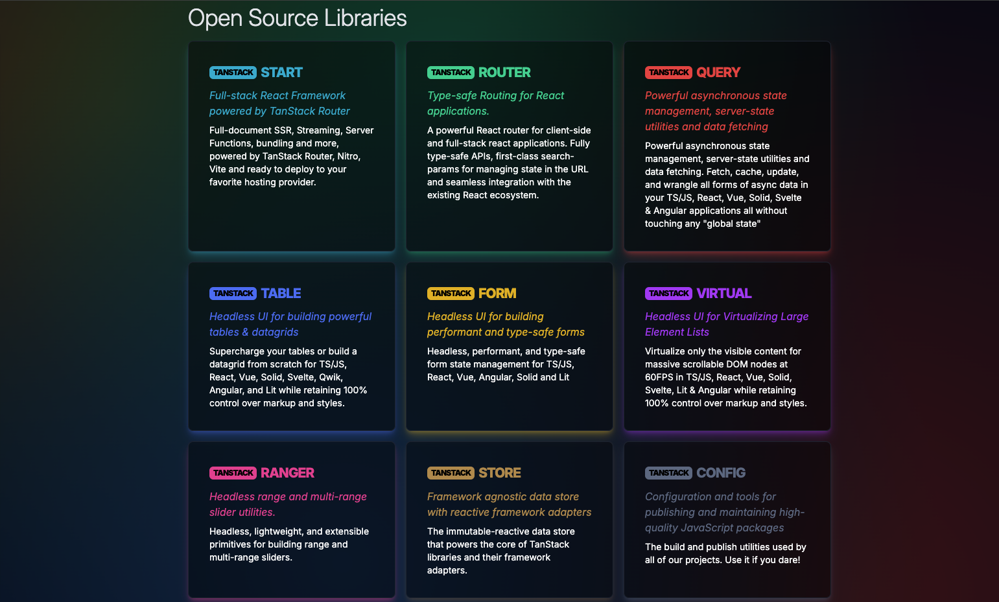

---
---

# Meet TanStack




---
layout: two-cols
---
# The Magic Behind TanStack Start

<ul class="flex flex-col gap-5">
	<li v-click class="text-5xl">TanStack Router</li>
	<li v-click class="text-3xl">TanStack Query</li>
	<li v-click class="text-sm">Vinxi -> Nitro -> Vite</li>
</ul>

::right::

<div class="flex flex-col items-center gap-2" v-click>


## Tanner Linsley


</div>


---
---
# Why Do We Need Another Meta-Framework?

<div v-click>


## Client-First Philosophy 🎯


<ul class="mb-10">
	<li>Natural React development experience</li>
	<li>No "use client" directive chaos</li>
	<li>Opt-in to server features, not opt-out</li>
</ul>

</div>
<div v-click>
```tsx 
// Natural React code without directives
export function Component() {
  return <div>Client-side by default</div>
}
```
</div>
---
---
# Why Do We Need Another Meta-Framework?

## Cache = TanStack Query 🔄


<ul class="mb-10">
	<li>No new caching system to learn</li>
	<li>Same patterns you already use in production</li>
</ul>

<div v-click>

```tsx
// Works seamlessly with loaders
export const route = createFileRoute('/users')({
  loader: async () => {
    // Same patterns, same caching, zero learning curve
    return queryClient.ensureQueryData({
      queryKey: ['users'],
      queryFn: getUsers
    });
  }
});

```
</div>
---
---
# Why Do We Need Another Meta-Framework?

## Smart Data Handling - No More Full Page Refreshes 🚀


<ul class="mb-10">
  <li>No more "all or nothing" data fetching approach</li>
  <li>No more waiting for slow data to show fast data</li>
  <li>Only refetch what actually changed</li>
</ul>

<div v-click>

```tsx
// Update user profile without refreshing entire page
export const updateProfile = createServerFunction('post')(
  async (data) => {
    await saveProfile(data);
    // Only invalidate profile data, everything else stays cached
    queryClient.invalidateQueries({ 
        queryKey: ['profile', userId] 
      });  }
);
```
</div>

---
---
# Why Do We Need Another Meta-Framework?

## Incremental Adoption 📈


<ul class="mb-10">
  <li>Easy migration path from existing apps</li>
  <li>Start with client-side features</li>
  <li>Add server capabilities gradually</li>
  <li>No need for full rewrites</li>
</ul>

